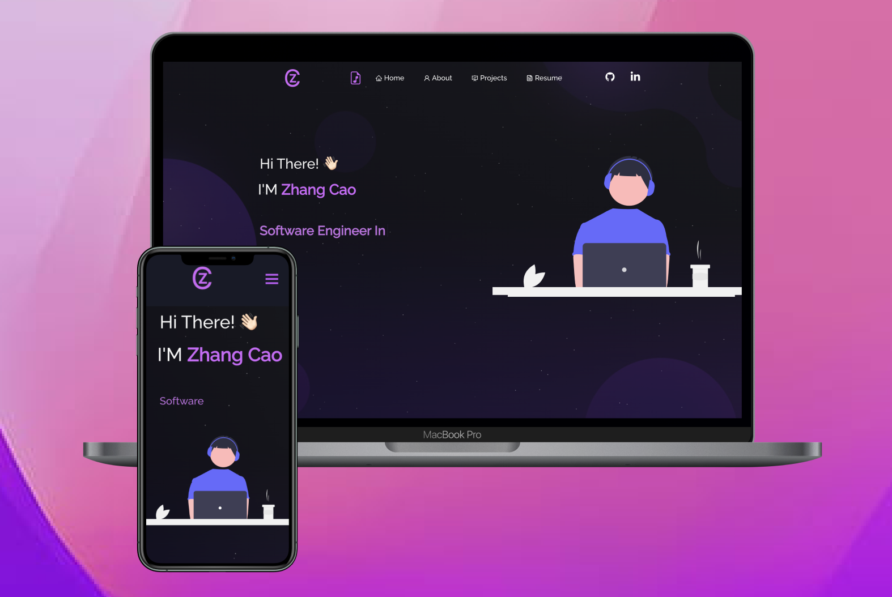

<h2 align="center">
  Portfolio Website
</h2>
<h3 align="center">
  I used the website template from https://github.com/soumyajit4419/Portfolio
</h3>

  

 

## Getting Started

Clone down this repository. You will need `node.js` and `git` installed globally on your machine.

## 🛠 Installation and Setup Instructions

1. Installation: `yarn`

2. In the project directory, you can run: `yarn run start`

## Built With

My personal portfolio features some of my github projects as well as my resume and technical skills. 

This project was built using these technologies.

- React.js
- Node.js
- Express.js
- CSS3
- VsCode

## Features

**📖 Multi-Page Layout**

**🎨 Styled with React-Bootstrap and Css with easy to customize colors**

**📱 Fully Responsive**

Runs the app in the development mode.\
Open [http://localhost:3000](http://localhost:3000) to view it in the browser.
The page will reload if you make edits.
